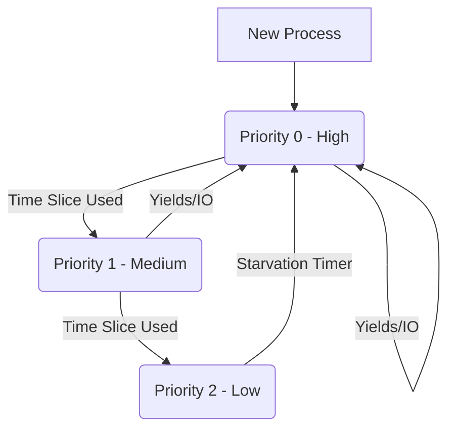

# XV6 Kernel Scheduler & Synchronization ⚙️

[](https://en.cppreference.com/w/c)
[](https://riscv.org/)
[](https://pdos.csail.mit.edu/6.828/2012/xv6.html)

**Kernel-level engineering project** focused on optimizing the process scheduling algorithm of the educational XV6 operating system (RISC-V). The default Round-Robin scheduler was replaced with a robust **Multi-Level Feedback Queue (MLFQ)** to optimize CPU throughput and response time.

---

## 🧠 Core Engineering Features

### 1. Multi-Level Feedback Queue (MLFQ) Scheduler
Replaced the basic Round-Robin scheduler with a priority-based system to handle mixed workloads (I/O-bound vs CPU-bound).

* **Priority Queues:** Implemented 3 distinct priority levels.
* **Dynamic Promotion/Demotion:** Processes consuming their time quantum are demoted; interactive processes yielding CPU are kept at high priority.
* **Anti-Starvation Mechanism:** "Priority Boosting" periodically resets all processes to the highest priority to prevent starvation of CPU-intensive tasks.

### 2. Kernel-Space Semaphores
Implemented distinct system calls for synchronization, enabling safe concurrency in user space.
* `sem_open(id, value)`: Initialize or retrieve a named semaphore.
* `sem_up(id)` / `sem_down(id)`: Atomic increment/decrement operations (V/P) handling process sleep/wakeup within the kernel.
* `sem_close(id)`: Resource cleanup.

---

## 🏗️ Architecture Visualization

**Scheduling Logic Flow:**



---

## 🛠️ Technical Implementation Details

### The Process Control Block (PCB)
Modified the `struct proc` definition in `kernel/proc.h` to track scheduling metrics:
```c
struct proc {
  // ... existing fields ...
  int priority;       // Current queue level (0-2)
  int ticks_count;    // Ticks consumed in current quantum
  int wait_time;      // Time spent waiting (for aging metrics)
};
```

### MLFQ Logic Snippet
The scheduler loop was rewritten to scan queues in strict priority order:
```c
// Scheduler Concept
void scheduler(void) {
  for(;;) {
    // 1. Scan High Priority Queue
    // 2. If empty, Scan Medium Priority Queue
    // 3. If empty, Scan Low Priority Queue (Round Robin)
    
    // Context Switch to selected process
    swtch(&c->context, &p->context);
  }
}
```

---

## 💻 Building & Running

Requirements: `qemu-system-riscv64` and `gcc-riscv64-linux-gnu`.

```bash
# Compile and boot QEMU
make qemu

# Run scheduler tests (custom user program)
$ schedtest
```

---

### 📝 Credits
Developed as a Kernel Hacking Lab for **Operating Systems** at **FaMAF - UNC**.